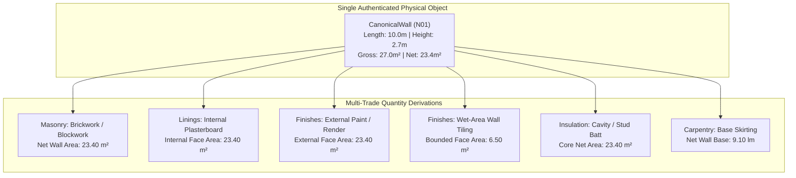

# Cross-Trade Geometry Reuse Architecture (v1.0)
**Task Reference:** AG-13 — CROSS-TRADE GEOMETRY REUSE  
**Authority:** PlanReader Autonomous Integration Authority  
**Repository:** `PlanReader-3D`  
**Date:** 2026-10-01  

---

## 1. Architectural Principle

In traditional estimation systems, every trade (concreting, masonry, carpentry, plastering, painting, tiling, roofing) re-measures drawings in isolation. This creates massive divergence, duplicate calculation errors, and inconsistent quantities across trades.

PlanReader's core architecture mandates:
> **EXTRACT ONCE → REUSE EVERYWHERE**  
> One authenticated physical building object serves as the single source of geometric truth for multiple downstream trade quantities.

---

## 2. Cross-Trade Derivation Matrix

### 2.1 Physical Wall (`CanonicalWall` / Registered Wall)
| Trade Scope | Item / Element | Derivation Basis | Unit | Pre-conditions |
|---|---|---|---|---|
| **Masonry** | Brickwork / Blockwork core | Net wall area ($L \times H - \sum \text{Openings}$) | $m^2$ | Verified wall height & openings |
| **Linings** | Internal Plasterboard | Interior face net area | $m^2$ | Host wall net area corroborated |
| **Painting** | Internal / External Paint | Face net area $\times$ coat count | $m^2$ | Finish schedule / callout binding |
| **Tiling** | Wall Tiles | Wet-area face net area (to spec height) | $m^2$ | Room tile height specification |
| **Insulation** | Wall Insulation Batts | Wall cavity/stud net area | $m^2$ | Wall thickness & spec |
| **Carpentry** | Skirting / Architraves | Wall base length minus door widths | $lm$ | Verified door openings |

### 2.2 Physical Slab / Floor (`CanonicalFloor`)
| Trade Scope | Item / Element | Derivation Basis | Unit | Pre-conditions |
|---|---|---|---|---|
| **Concrete** | Slab Concrete | Footprint area $\times$ thickness | $m^3$ | Verified slab thickness |
| **Formwork** | Slab Soffit Formwork | Underside boundary area | $m^2$ | Suspended slab classification |
| **Formwork** | Slab Edge Formwork | Slab perimeter $\times$ edge thickness | $m^2$ | Calibrated perimeter |
| **Waterproofing** | Vapor Barrier / Membrane | Slab plan footprint area | $m^2$ | Ground-bearing slab |
| **Reinforcement** | Slab Reinforcing Mesh | Plan area $\times (1 + \text{lap\_factor})$ | $m^2$ | Engineering schedule |
| **Finishes** | Floor Finishes (Tile/Carpet) | Enclosed room floor areas | $m^2$ | Spatial boundary |

### 2.3 Physical Roof (`CanonicalRoof`)
| Trade Scope | Item / Element | Derivation Basis | Unit | Pre-conditions |
|---|---|---|---|---|
| **Roofing** | Roof Cladding (Sheet/Tile) | Plan area $\times \sec(\text{pitch})$ | $m^2$ | Verified pitch angle ($\theta$) |
| **Carpentry** | Roof Framing / Battens | Raked roof surface area | $m^2$ | Verified pitch |
| **Insulation** | Roof Sarking / Blanket | Raked roof surface area | $m^2$ | Verified pitch |
| **Plumbing** | Eaves Gutters | Eaves perimeter run | $lm$ | Roof perimeter |
| **Roofing** | Ridge Capping / Valleys | Ridge and valley seam lengths | $lm$ | Roof facet topology |

### 2.4 Physical Room / Space (`CanonicalSpace`)
| Trade Scope | Item / Element | Derivation Basis | Unit | Pre-conditions |
|---|---|---|---|---|
| **Finishes** | Floor Covering | Specified floor area | $m^2$ | Verified polygon area |
| **Linings** | Ceiling Plasterboard | Specified ceiling area | $m^2$ | Horizontal RCP projection |
| **Finishes** | Ceiling Paint | Ceiling area $\times$ coats | $m^2$ | Ceiling lining verified |
| **Carpentry** | Skirting Boards | Room perimeter $-\sum \text{Door Widths}$ | $lm$ | Boundary polygon + door widths |
| **Plastering** | Cornice Trim | Room perimeter | $lm$ | Boundary polygon |
| **Plumbing** | Fixture Rough-Ins | Count of verified fixtures in space | $ea$ | Fixture symbol evidence |

---

## 3. Strict Derivation Invariants
1. **No Speculative Hallucination:** A trade quantity is NEVER derived unless the prerequisite geometric parameters (e.g. wall height, slab thickness, roof pitch) are authenticated. Missing prerequisites cause fail-closed abstention.
2. **Immutable Host Reference:** Every derived quantity row references the exact ID of the host building object (`host_object_id`).
3. **Synchronized Updates:** Modifying a host object (e.g. updating a wall's opening deductions or height) automatically cascades to all derived trade quantities.
